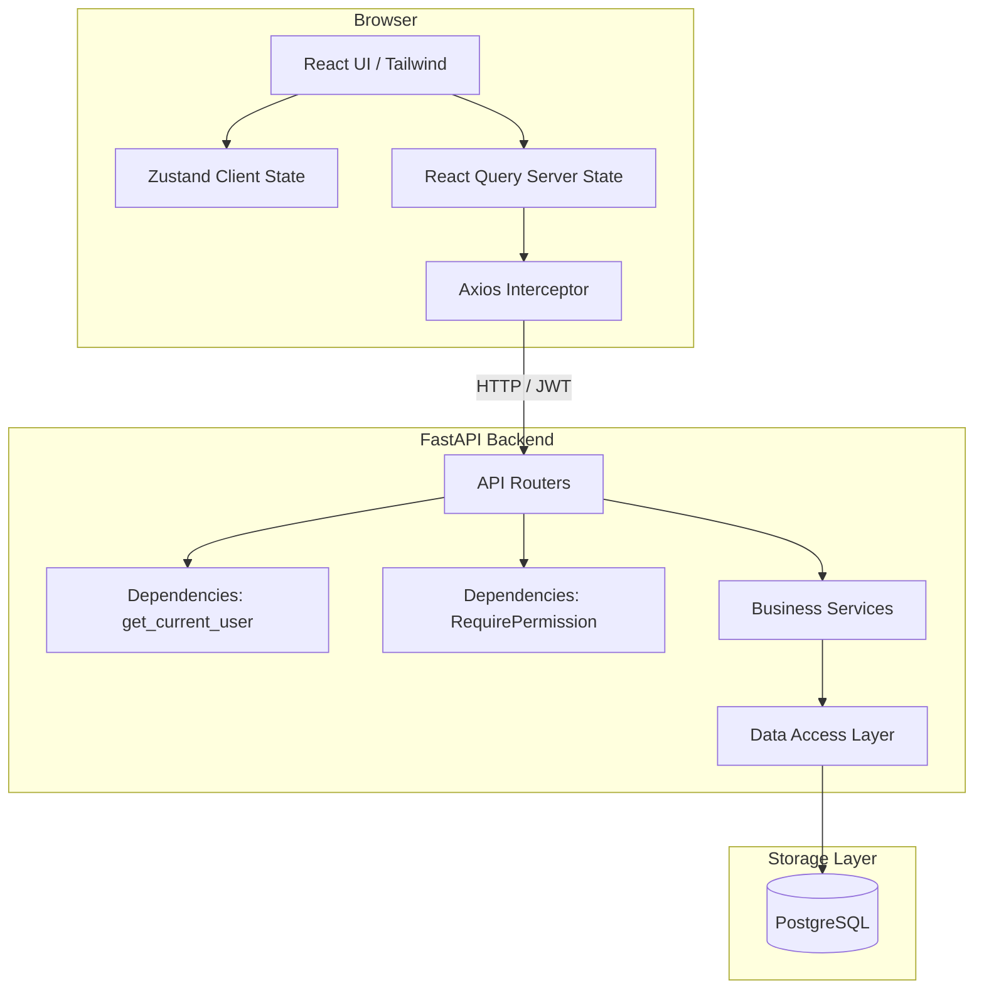
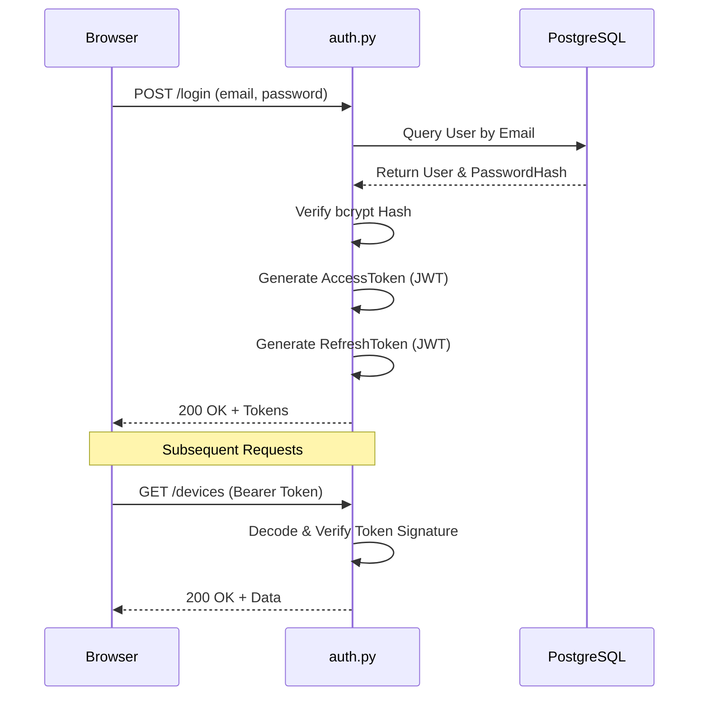
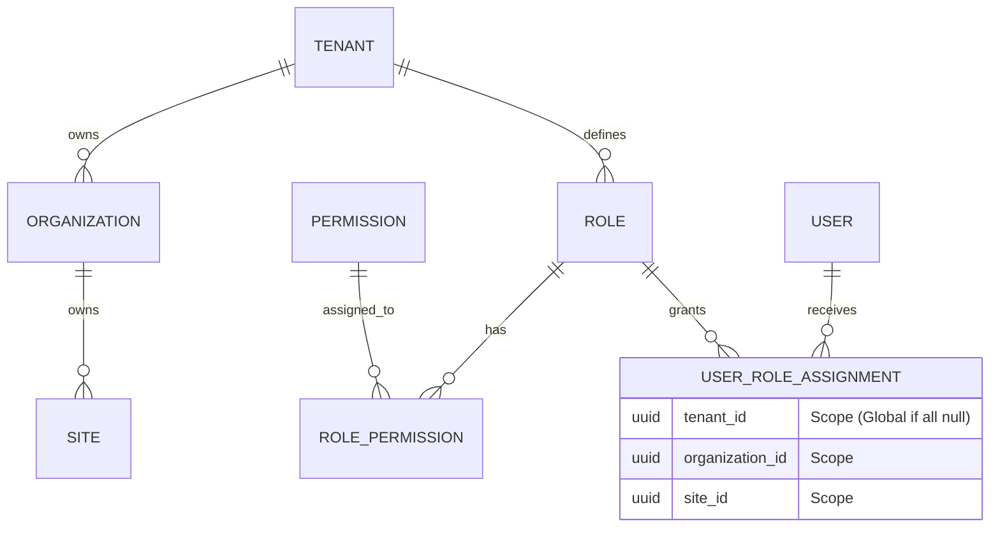

# System Knowledge Graph
**Type**: Architecture & Interaction Maps
**Based on**: `FILE_INVENTORY.md`

## 1. High-Level System Architecture

## 2. Authentication Flow

## 3. RBAC (Role-Based Access Control) Graph

