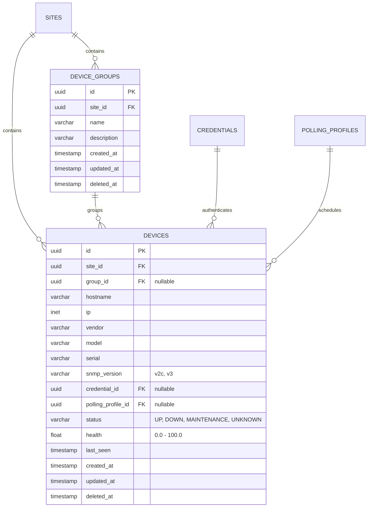

# Device Domain Design

## 1. Domain Overview
The `Device` domain represents physical or logical network nodes managed by NS3 Central. Devices are the core entities that are polled, monitored, and analyzed.

## 2. Entity Hierarchy
- **Site**: The physical or logical location.
- **DeviceGroup**: A logical collection of devices within a site (e.g., "Core Routers", "Access Switches").
- **Device**: The individual network entity.

## 3. Device Data Model

## 4. Lifecycle States
- **UP**: Actively responding to polls.
- **DOWN**: Failed consecutive polls.
- **MAINTENANCE**: Administratively silenced (no alerts generated).
- **UNKNOWN**: Newly provisioned, not yet polled.

## 5. Security & Isolation
- IP addresses can overlap across Tenants, but are strictly isolated within the context of a Site/Tenant.
- Credentials (`credential_id`) are stored in an encrypted vault, never in plain text in the device record.
