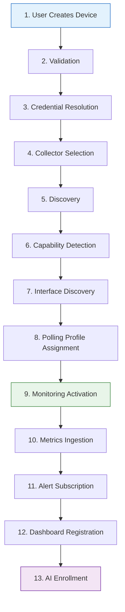

# Device Provisioning Specification

This document serves as the frozen, definitive contract for the end-to-end onboarding flow of a network device into NS3 Central. It details exactly how a device transitions from a user's intent to a fully monitored, AI-analyzed asset.

## 1. End-to-End Onboarding Flow

## 2. Step-by-Step Specification

### 1. User Creates Device
- **Action**: User submits a POST request to `/api/v1/devices` with basic metadata (hostname, management IP, site_id).
- **State**: Device is created in PostgreSQL with `lifecycle_state = 'PROVISIONING'`, `admin_state = 'ENABLED'`, `oper_state = 'UNKNOWN'`.

### 2. Validation
- **Action**: The API validates that the IP/hostname is unique within the Tenant/Site scope.
- **Event**: Emits `DeviceProvisioningStartedEvent`.

### 3. Credential Resolution
- **Action**: Based on user input or automated site-wide rules, a `CredentialProfile` (e.g., SSH keys, SNMP communities) is mapped to the device via the `DeviceCredentialAssignment` table.
- **Security**: The raw credentials are NEVER stored on the device record itself.

### 4. Collector Selection
- **Action**: The system identifies active `Collector` instances assigned to the device's `Site`.
- **Assignment**: Utilizing consistent hashing (based on `device_id`), the device is pinned to a specific collector via `DeviceCollectorAssignment`.

### 5. Discovery
- **Action**: The Control Plane dispatches a one-off `DiscoveryTask` to the assigned Collector.
- **State Change**: `lifecycle_state = 'DISCOVERING'`.
- **Execution**: Collector performs an ICMP sweep followed by SNMP `sysObjectID` retrieval.

### 6. Capability Detection
- **Action**: Based on the `sysObjectID`, the Collector determines the vendor (e.g., Cisco, Juniper) and OS.
- **Update**: Device record is updated with `vendor`, `model`, `os`, and boolean capability flags (`supports_snmp`, `supports_ssh`, etc.).

### 7. Interface Discovery
- **Action**: Collector performs an SNMP `GETBULK` against the IF-MIB.
- **Storage**: Discovered interfaces are inserted into the `Interfaces` table and linked to the Device. Interface operational states (`UP`/`DOWN`) are recorded.

### 8. Polling Profile Assignment
- **Action**: The system assigns a `PollingProfile` (e.g., "Standard Switch Polling - 60s") and an `SNMPProfile` to the device.

### 9. Monitoring Activation
- **Action**: The Polling Engine's timing wheel begins generating recurring `PollTask` messages for this device.
- **State Change**: `lifecycle_state = 'ACTIVE'`.

### 10. Metrics Ingestion
- **Action**: The Collector executes the polling profile, normalizes the raw SNMP data, and pushes it back via Redis.
- **Storage**: The ingestion worker maps the data to `MetricSeries` and executes a bulk insert into TimescaleDB `MetricSamples`.

### 11. Alert Subscription
- **Action**: The Alert Engine begins actively evaluating the device's metric streams against `AlertRules` bound to the device's `DeviceGroup` or `DeviceTags`.

### 12. Dashboard Registration
- **Action**: The device is now visible in the Tenant's live topology maps. WebSocket subscriptions can now bind to `ws:metrics:device_{id}` to stream live charts.

### 13. AI Enrollment
- **Action**: The `DeviceProvisioningCompletedEvent` triggers the AI Layer. The AI Agent hydrates its RAG database with the new device's topology context, making it immediately available for Natural Language queries (e.g., "Show me the CPU trend for the newly added switch").
