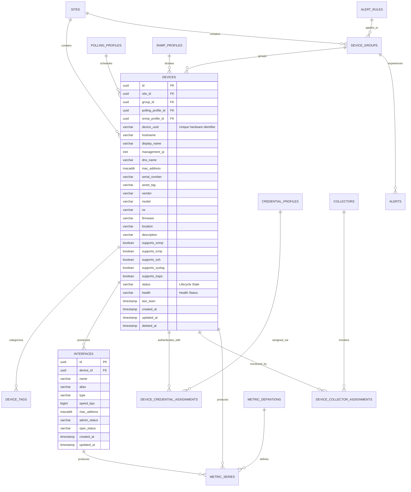
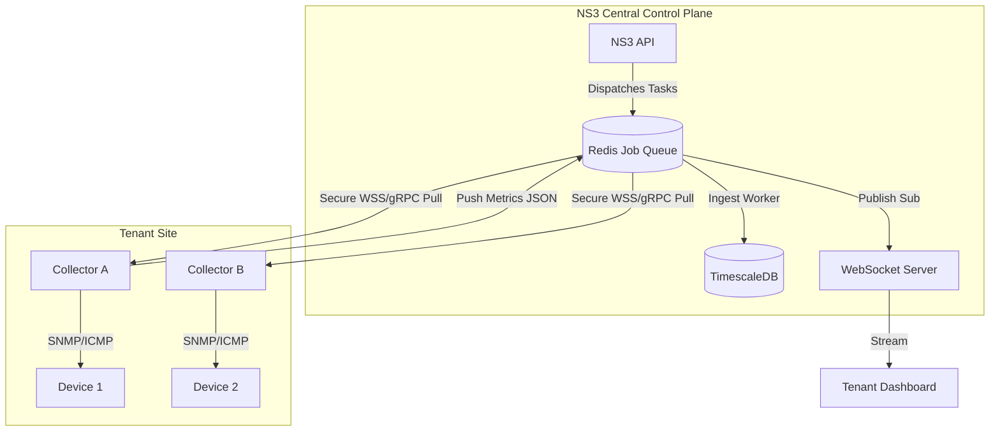

# Phase 7 Technical Design Review: Device & Telemetry Foundation

This document freezes the technical architecture for the Device Inventory, Polling, Metrics, Alerts, and Dashboard domains. It serves as the definitive blueprint before writing code for Phase 7.

## 1. Complete Device ERD

## 2. Device State Machine & Lifecycle

The lifecycle represents the business state, while health represents operational stability.

**Lifecycle Status (status)**:
- `PROVISIONING`: Record created, awaiting validation.
- `DISCOVERING`: Awaiting initial feature and capability interrogation.
- `ACTIVE`: Fully managed and actively polled.
- `UNREACHABLE`: Failing core reachability (ICMP/SNMP).
- `MAINTENANCE`: Administratively silenced for maintenance.
- `DISABLED`: Polling administratively halted.
- `RETIRED`: No longer managed, retained for historical reporting.
- `DECOMMISSIONED`: End of life, slated for soft-deletion.

**Operational Health (health)**:
- `UNKNOWN`: No data collected yet.
- `GOOD`: All metrics within normal baselines.
- `WARNING`: Minor threshold breaches.
- `CRITICAL`: Major threshold breaches or critical alert active.

## 3. Collector Assignment Architecture

Collectors are stateless, horizontally scalable agents deployed within customer networks.

## 4. Flows and Pipelines

### A. Polling Engine Sequence
1. **Scheduler** checks `PollingProfile` interval (e.g. 60s).
2. **Scheduler** publishes `PollTask` to Redis Stream `tasks.site_id`.
3. **Collector** assigned to `site_id` consumes the task.
4. **Collector** executes network call.
5. **Collector** publishes `PollResult` to Redis Stream `results.site_id`.
6. **ResultProcessor** updates `Device.last_seen`.

### B. Metric Ingestion Pipeline
1. `PollResult` containing raw metrics enters Redis.
2. **Metrics Worker** consumes the payload.
3. Maps metric to `MetricDefinition` and `MetricSeries`.
4. Executes bulk `INSERT` into **TimescaleDB** hypertable.
5. Publishes raw point to Redis Pub/Sub for WebSockets.

### C. Alert Evaluation Flow
1. **Alert Engine** subscribes to Redis metrics stream.
2. Cross-references incoming metrics against `AlertRule` (applied via `DeviceGroup`).
3. If threshold breached, engine executes `SELECT FOR UPDATE` on active Alerts table to debounce.
4. Creates/Updates `Alert` record.
5. Publishes `AlertTriggeredEvent` to Domain Event Bus.
6. **Notification Worker** handles outbound emails/webhooks.

### D. Dashboard Query Architecture
- **Metadata**: Standard PostgreSQL queries for topology (Sites, Devices, Groups).
- **Historical Data**: REST API queries TimescaleDB leveraging `time_bucket()` and continuous aggregates.
- **Live Data**: UI subscribes via WebSocket to Redis Pub/Sub channels (e.g., `ws:metrics:device_id:cpu`).

## 5. Persistence and Scale Strategies

### TimescaleDB Hypertable Design
- **Table**: `metric_samples`
- **Columns**: `time` (TIMESTAMPTZ), `series_id` (UUID), `value` (FLOAT).
- **Partitioning**: Chunked by `time` (1 day intervals) and hash partitioned by `tenant_id` if scaling out horizontally.
- **Continuous Aggregates**: Materialized views for 1-hour and 1-day rollups to power long-term dashboard queries without scanning raw tables.

### Redis Caching Strategy
- **Session & Auth**: User sessions and JWT blacklists.
- **Permission Cache**: Evaluated RBAC scopes cached per user to prevent redundant DB hits on every API request.
- **Live State Cache**: Device `status` and `last_seen` cached to reduce UPDATE contention on the PostgreSQL primary.
- **Pub/Sub**: Used exclusively for ephemeral WebSocket streaming.

### PostgreSQL Indexing Strategy
- Composite indexes unconditionally include `tenant_id` for multitenant isolation.
- B-Tree indexes on `(tenant_id, status, deleted_at)`.
- GIN indexes (`pg_trgm`) on `hostname`, `ip`, and `description` to enable rapid wildcard searches across thousands of devices.

### Horizontal Scaling Strategy (100k+ Devices)
- **Control Plane API**: Horizontally scaled behind a load balancer. Stateless due to Redis session storage.
- **Polling Workers**: Horizontally scaled. If Redis Stream lags, additional Python/Go consumers are spun up.
- **Collectors**: Auto-scaled at the edge. Devices are pinned to collectors via consistent hashing on `device_id` to ensure cache locality (e.g. SNMP engine IDs).
- **Database**: TimescaleDB handles 100k+ inserts/sec natively. Read replicas handle dashboard queries.

### Failure Recovery & Retry Strategy
- **Collector Disconnects**: If a Collector drops its WebSocket/gRPC connection, the Control Plane immediately triggers a rebalance event. Pending tasks in the Redis Stream are re-assigned to healthy Collectors in the same Site group.
- **Device Timeouts**: Polling tasks utilize exponential backoff. After 3 consecutive timeouts, the Device status transitions to `UNREACHABLE`, pausing high-frequency polling and generating an Alert.
