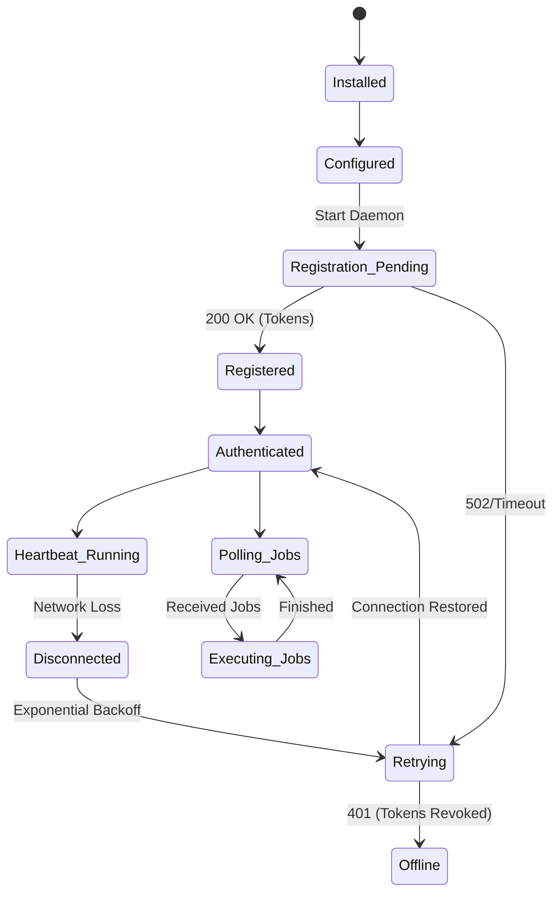

# Collector Lifecycle & State Machine

**Status**: Active Specification
**Scope**: The complete lifecycle states of a Collector Agent.

This state machine is the immutable reference for how a Collector behaves. Every future feature (upgrades, polling, discovery) must conform to these states.

---

## 1. State Definitions

### 1. `Not Installed`
- **Definition**: The software has not been downloaded or extracted on the host machine.
- **Action**: User downloads the daemon.

### 2. `Installed`
- **Definition**: The daemon binary/script exists on the machine.
- **Action**: User modifies `config.yml` or sets environment variables.

### 3. `Configured`
- **Definition**: The `config.yml` contains a `registration_key` and a `central_url`.
- **Action**: Daemon starts up.

### 4. `Registration Pending`
- **Definition**: The daemon is attempting to contact `POST /api/v1/collectors/register`.
- **Transitions**:
  - **Success** -> `Registered`
  - **Failure (401/403/426)** -> `Fatal Error` (Halts)
  - **Network Timeout (50x)** -> `Retrying`

### 5. `Registered`
- **Definition**: The backend has validated the Registration Key, inserted the Collector into the database, and returned Access and Refresh Tokens. The Collector writes these tokens to a secure local `.token` file.
- **Transitions**: Immediately transitions to `Authenticated`.

### 6. `Authenticated` (Baseline Operational State)
- **Definition**: The Collector possesses a valid Access Token and is ready to perform network operations.
- **Transitions**: Initiates the background `Heartbeat Loop` and `Polling Loop`.

### 7. `Heartbeat Running`
- **Definition**: The background task successfully sending `POST /heartbeat` every N seconds.
- **Sub-State Transitions**:
  - **Receives configuration updates** (e.g., new poll_interval, or `minimum_version > current_version` -> triggers `Upgrade Required`).
  - **Network Loss** -> `Disconnected`

### 8. `Polling Jobs`
- **Definition**: The Collector is actively calling `POST /api/v1/collectors/{id}/jobs/pull` and declaring its available capacity.
- **Transitions**:
  - **Receives Jobs** -> `Executing Jobs`
  - **Empty Queue** -> Waits `poll_interval` and repeats.

### 9. `Executing Jobs`
- **Definition**: Background threads are executing ICMP, SNMP, or SSH tasks. Results are buffered locally and pushed to `/api/v1/metrics/ingest`.
- **Transitions**: Upon completion of the batch, returns to `Polling Jobs`.

### 10. `Disconnected`
- **Definition**: The Collector failed to reach the Central Server (Timeout, 502, DNS failure).
- **Action**: Halts job pulling. Initiates exponential backoff.
- **Transitions**: -> `Retrying`.

### 11. `Retrying`
- **Definition**: Attempting to reconnect using exponential backoff (5s, 10s, 20s... up to 300s max).
- **Transitions**:
  - **Success** -> `Reconnected` (Resumes Heartbeats & Polling)
  - **Failure (401 Unauthorized)** -> Access token expired. Attempts `/refresh`. If refresh fails, tokens are wiped, transitions to `Offline / Fatal Error`.

### 12. `Offline`
- **Definition (Backend)**: The backend calculates `NOW() - last_heartbeat > 180s` and flags the Collector as Offline in the UI. Alerts may trigger.
- **Definition (Collector)**: The daemon has permanently halted due to revoked credentials, disk corruption, or process death.

---

## 2. Diagram

