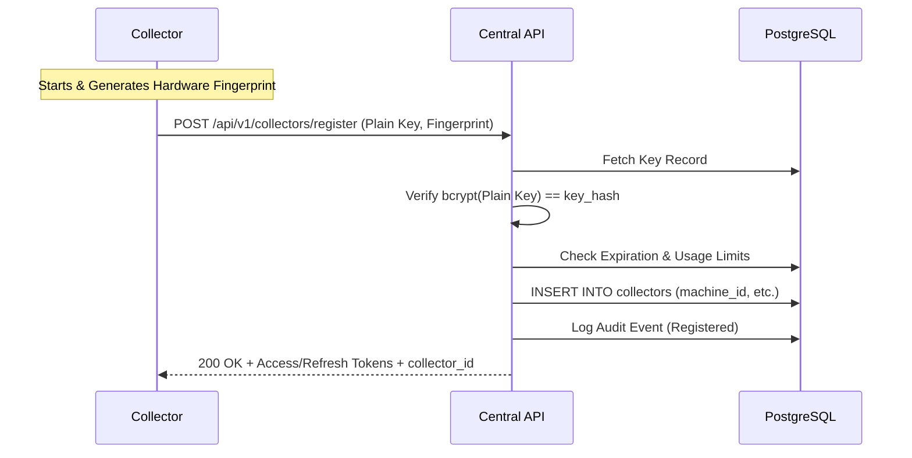

# Phase 1: Collector Foundation

**Status**: Approved Specification

## 1. Goals
- Establish the communication bridge between the Central FastAPI backend and distributed, on-premise Collector agents.
- Prove that a remote agent can securely authenticate, register, and maintain a heartbeat with the central server.
- Reflect the real-time status of Collectors in the frontend UI based on derived heartbeat timestamps.

## 2. Scope (Collector MVP)
- Build a Python-based standalone Collector daemon with a scalable folder structure.
- Implement an API-based Registration handshake to exchange an expiring `Registration Key` (hashed in DB) for Access and Refresh tokens.
- Generate a permanent `collector_uuid` and machine fingerprint to prevent cloning.
- Implement a 60-second Heartbeat loop providing rich metadata (CPU, mem, version) and receiving backend configuration.
- Implement a Job Polling loop via `POST /api/v1/collectors/{id}/jobs/pull`.
- Build the corresponding FastAPI endpoints and database schemas.
- Build background cleanup crons (Collectors -> offline; Expired Keys -> disabled).

## 3. Non-Goals
- No SNMP or ICMP polling yet.
- No Metrics ingestion or TimescaleDB yet.

## 4. Architecture
- **Communication Protocol**: Strictly outbound HTTPS REST calls from the Collector to the Central API.
- **Derived Status**: The backend never explicitly stores `status = online`. Status is always computed dynamically: `NOW - last_heartbeat < 60s` (Online), `< 180s` (Warning), else (Offline).
- **Configuration via Heartbeat**: The heartbeat acts as a two-way sync. Collector sends its system metadata; Backend replies with configuration (poll_intervals, version requirements, log levels).

## 5. Security & Authentication
- **Hashed Registration Keys**: Plain text keys are generated, shown once to the user, and immediately hashed using bcrypt in the database (`key_hash`).
- **Collector Identity**: The collector generates a hardware-based fingerprint (`machine_id`, MAC hash, CPU serial) during registration.
- **Collector Tokens**: Access Token (30 min) and Refresh Token (30 days), identical to user authentication.

## 6. Sequence Diagrams

### Registration Flow


## 7. Folder Structures

**Collector Daemon**:
```
collector/
├── main.py
├── config.py
├── settings.py
├── auth.py
├── heartbeat.py
├── jobs.py
├── api.py
├── models.py
├── system_info.py
├── scheduler.py
└── constants.py
```

**Backend (FastAPI)**:
```
backend/app/
├── api/v1/endpoints/collectors.py
├── services/collector_service.py
├── crud/collector.py
├── models/collector.py
└── schemas/collector.py
```

## 8. Database Tables Affected
- **Updated**: `collectors` (Removing manual `status`. Adding `machine_id`, `version`, `platform`, `capabilities`).
- **New**: `collector_registration_keys` (id, tenant_id, site_id, key_hash, expires_at, max_registrations, used_count, created_by, created_at, revoked_at, notes).
- **New**: `audit_events` (To log "Collector Registered", "Collector Offline").
